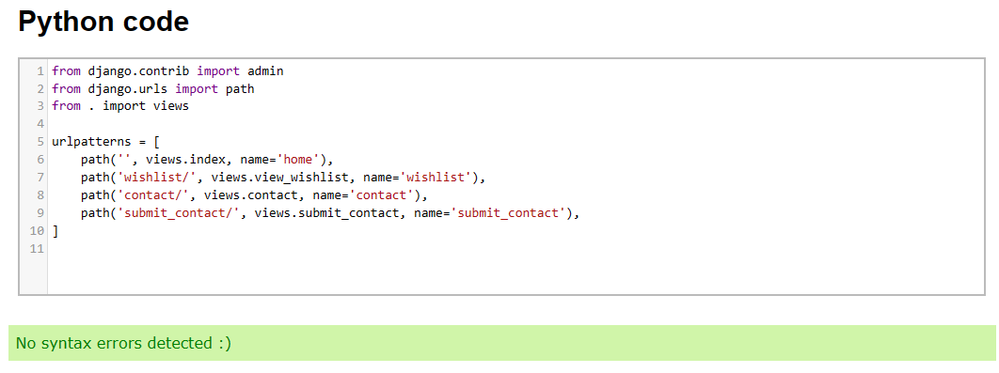

# The Fitness Den
Developed by **Dorian Wolarz**, a Code Institute Student

*The Fitness Den is a Full Stack fitness website. Users can create personal accounts and purchase fitness products. In a general sense it will be an online store for your average fitness fanatic.*

[LINK TO HEROKU VERSION](https://fitness-den-01445db6e33a.herokuapp.com/)

## Contents
1. [Project Goals](#project-goals)
    - [User Goals](#user-goals)
    - [Site Owner Goals](#site-owner-goals)
2. [User Experience](#user-experience)
    - [Admin Stories](#admin-stories)
    - [User Stories - Navigation](#user-stories---navigation)
    - [User Stories - Accounts and Management](#user-stories---accounts-and-management)
    - [User Stories - Purchases](#user-stories---purchases)
3. [Design and Business Model](#design-and-business-model)
    - [Design](#design)
    - [Colour and Fonts](#colour-and-fonts)
    - [Facebook 'Fitness Den' Mock Up](#facebook-fitness-den-mock-up)
    - [Business Model, Marketing and Search Engines](#business-model-marketing-and-search-engines)
    - [Marketing Types Challenge - Questions and Answers](#marketing-types-challenge---questions-and-answers)
    - [Structure](#structure)
    - [Wireframes](#wireframes)
4. [Data Models](#data-models)
    - [Product Review](#product-review)
    - [Contact Form](#contact-form)
    - [Wishlist](#wishlist)
5. [Technologies Used](#technologies-used)
6. [Testing and Validation](#testing-and-validation)
    - [HTML Validation](#html-validation)
    - [CSS Validation](#css-validation)
    - [Python Validation](#python-validation)
    - [Accessibility and Performance](#accessibility-and-performance)
    - [Manual Testing of Admin and User Stories](#manual-testing-of-admin-and-user-stories)
        - [Admin Stories Testing](#admin-stories-testing)
        - [User Stories Testing](#user-stories-testing)
            - [Testing of Navigation](#testing-of-navigation)
            - [Testing of Accounts and Management](#testing-of-accounts-and-management)
            - [Testing of Purchases](#testing-of-purchases)
7. [Known Bugs](#known-bugs)
8. [Deployment](#deployment)
9. [Credits](#credits)

## Project Goals

### User Goals

* Easily navigate across a clean user interface.
* Register an account. Log in and out. Receive confirmation e-mails.
* View a list of products, their descriptions, ratings, pricing and other details. Leave reviews on products.
* Identify special deals and clearance items.
* Sort existing available products by categories. Search for products by name and description.
* Access my shopping cart, see my order history, securely save and edit my personal payment information.
* Subscribe to a monthly newsletter.
* Select the quantity of a product, adjusting the quantity in the shopping cart, view an order and e-mail confirmation after checkout.

### Site Owner Goals

* Facilitate a solid, pleasurable browsing experience for new customers and allow them to make secure purchases on my website.
* Promote user engagement by making a clear-to-navigate UI where users can see all the relevant products.
* Add and delete products, as well as edit and update existing products so real time changes can be made to my stocks.
* Have a footer section with all the important details so clients can contact through e-mail and socials, find out more about the store and sign up to a newsletter.

## User Experience

For the purpose of this project I have created a list of fitting user and admin stories to serve as a design guide in creating this webpage. *The Fitness Den* is a store selling fitness products and, as such, I based it on the Code Institute project of *Boutique Ado* given the similar theme. I've come up with the following user and admin stories thus far:

### Admin Stories

* As a **site admin** I can **add a product** so that **I can increase the stocks in my store**.
* As a **site admin** I can **edit and update existing products** so that **I can make real time changes to my stocks**.
* As a **site admin** I can **delete a product** so that **I can remove an existing item from the listings**.
* As a **site admin** I can **have a footer section with important details** so that **my clients can contact me, find out more about the store and its mission and sign up to a newsletter**.

### User Stories - Navigation

* As a **site user** I can **view a list of products** so that **I can purchase items**.
* As a **site user** I can **identify the price, description, product rating and other details** so that **I can purchase a product to my liking**.
* As a **site user** I can **identify deals, clearance items and special offers** so that **I can make the purchases I want**.
* As a **site user** I can **view the total purchases** so that **I can avoid spending funds beyond my budget**.
* As a **site user** I can **sort the list of available products** so that **I can identify best rated and best priced items**.
* As a **site user** I can **sort a specific category of product** so that **I can find the best deals in the category I'm interested in**.
* As a **site user** I can **sort multiple categories simultaneously** so that **I can find best offers across multiple categories**.
* As a **site user** I can **search for a product by name or description** so that **I can easily find what I'm looking for**.
* As a **site user** I can **access search bar results** so that **I can quickly decide whether the product I want to purchase is available**.

### User Stories - Accounts and Management

* As a **site user** I can **easily register a user account** so that **I can have access to my personal profile**.
* As a **site user** I can **log in and out** of my profile so that **I can access my personal account information**.
* As a **site user** I can **safely recover my password** in case **I forget it**.
* As a **site user** I can **receive a confirmation e-mail after registration** so that **I can approve my profile**.
* As a **site user** I can **have a personalized user profile** so that **I can view my order history, order confirmations, as well as save and edit my personal payment information**.
* As a **site user** I can **subscribe to a monthly newsletter** so that **I can stay in touch with the store and be informed of new products**.
* As a **site user** I can **leave reviews on products** so that **I can let the merchant know my feedback**.
* As a **site user** I can **access a contact form** and send a **confidential message directly to the admin**.

### User Stories - Purchases

* As a **site user** I can **easily select the quantity and size of product** so that **I can purchase an item I desire**.
* As a **site user** I can **view the items I currently have in my bag** so that **I can identify the total cost of my purchase as well as the items I will receive**.
* As a **site user** I can **adjust the quantity of items in my shopping bag** so that **I can make changes to my purchase before checkout**.
* As a **site user** I can **enter my payment information** so that **checkout quickly**.
* As a **site user** I can **be certain that my personal and payment information are safe** so that **I can confidently provide sensitive information to make a purchase**.
* As a **site user** I can **view an order after I checkout** so that **I can verify I haven't made any mistakes**.
* As a **site user** I can **receive an e-mail confirmation after I checkout** so that **I can be sure my payment went through and so I can keep a record**.

I followed the *Agile Methodology* when developing user stories and all of them are available on a separate Project board as well.

## Design and Business Model

### Design

The webpage was designed with the concept of an online fitness store in mind, hence I decided to call it *"The Fitness Den"* in order to call upon the imagery of heavy weights, good health and a 'den' much like a lion's den. The website is meant to allow the users to purchase a wide range of fitness items, from whey protein to calisthenics parallettes. The chosen artistic direction is meant to be clean, organized and easily navigable. The content of the webpage is neatly divided between collapsible buttons in the case of mobile view and interactive buttons in the case of widescreen view.

### Colour and Fonts

Colour tones associated with college and sports were chosen as basis for the colour palette of the webpage. As such, the main colours are the contrasts of berkeley blue and plain white. The complimentary colours chosen were slate grey for tertiary text, plain black for buttons, harvest gold for star rating functionality and an almost turqouise highlight for mouse hover on certain items and key words. My intent behind the design was to call upon a fitting color theme which will make the client think of college, dynamic sports and even a positive play on a stereotype - to a degree - of the high school "jock" so often shown in American movies and other media. This visual style is a nostalgic callback not just to hit pieces like "High School Musical" but also a clear and deliberate attempt at targeting one of the most vital demographics in the fitness industry - the young adults. I made use of modern UI/UX design solutions in order to provide a visually pleasing, clear, accessible and usable webpage.

For the heading, navbar, slogan and all the major secondary fonts I chose *"Graduate"* because it's very clean and creates a very deliberate high school/college image.
For complimentary text I chose *"Teko"* because it is pleasing to the eye, soft and rounded while still keeping a suitable visual 'edge'.
*Arial*, *Helvetica* and *Sans-Serif* were chosen as the emergency backup fonts in case the selected ones refuse to load because they're basic fonts that should display without any issues on all devices and software.

### Facebook 'Fitness Den' Mock-Up

### Business Model, Marketing and Search Engines

*The Fitness Den* will follow a *product selling* business model in line with the **B2C** (*Business-to-Consumer*) philosophy, where the company and consumer will engage in commercial activity. The exact type of B2C that my fictional store will follow is **E-Commerce**, its biggest sector, encompassing all sorts of online stores, including my one.

The *marketing options* I have settled on are a mock-up of a **fictional Facebook business page** and the option to sign into a **monthly newsletter** ran by MailChimp. Moreover, I have also included **dummy social media links** in my footer, as well as my personal and real social media links.

I followed the Code Institute tutorial on *Search Engine Optimization* and created **robots.txt** and **sitemap.xml** files. Additionally I included two small **information boxes** in the footer which included **keywords** which have a chance to be picked up by any search engine of choice, while not being flagged as spam and filler.

### Marketing Types Challenge - Questions and Answers

1. Who are your users?
    * Fitness enthusiasts, health freaks, aspiring calisthenics gymnasts and bodybuilding fanatics.
2. Which online platforms would you find lots of your users?
    * YouTube, TikTok, Instagram, Reddit, online forums dedicated to fitness and personal wellbeing, 4chan, possibly Facebook as well.
3. Would your users use social media? If yes, which platforms do you think you would find them on?
    * Most definitely. Fitness gets a lot of traction on the social media I mentioned in the previous point. The introduction of 'Shorts' has been giving the fitness community a huge boost as well in recent years.
4. What do your users need? Could you meet that need with useful content? If yes, how could you best deliver that content to them?
    * My site users and customers would certainly need smooth website navigation, easy checkouts, a wide range of products, secure transactions and competitive prices. I'm confident I could deliver that content by having a clean UI, a fast website and a selection of the most popular products at fair prices.
5. Would your business run sales or offer discounts? How do you think your users would most like to hear about these offers?
    * It would, yes. I imagine my users would most like to hear about these offers by subscribing to a monthly newsletter so they're always kept up to date through their e-mails. Alternatively a social media presence - such as the Facebook mock-up - could work really well for shop stock updates.
6. What are the goals of your business? Which marketing strategies would offer the best ways to meet those goals?
    * We aim to revolutionize the digital fitness e-commerce sector. The best marketing strategies to meet those goals would be a significant and active social media presence, a clean and well functioning website, as well frequent discounts, deals and other offers.
7. Would your business have a budget to spend on advertising? Or would it need to work with free or low cost options to market itself?
    * It depends on how big it became. Initially it would be free, 'homemade' advertising or low cost options. Nowadays we live in an era where you can make it big if you're smart about how you use social media and observe the current trends. YouTube, TikTok and Instagram shorts have really changed the game in recent months.

### Structure

The website is structured in a user friendly way that makes navigation of its contents extremely easy and makes it pleasing to the eye. The *Home Page* serves as the central hub of the design, allowing for quick access to other sections of the project through fully interactive buttons. Overall the project is made up of many pages, including but not limited to:
* **The Home Page**, with its selection of navigational buttons and a collapsible menu for mobile users, as well as its highly informational footer.
* **The Products Page**, with its long list of available products separated by categories as well as an individual product view with user reviews.
* **The Contact Page**, with its direct confidential message to admin functionality.
* **The Shopping Bag Page**, with its easy-to-use shopping bag functionality of adding, adjusting and removing items from the shopping bag.
* **The Checkout Page**, with the ability to use existing delivery information and finalize any transaction.
* **The Wishlist Page**, where the user can save products for later purchase.
* **Profile Page**, with its ability to securely save personal information and access client's order history.
* **Log In and Log Out Pages**, which allow the clients to register on the page, log in and retrieve their account if password is lost.

*...and many more.*

### Wireframes

  
PC Wireframe

  

  
Mobile Wireframe

  

  
User Stories Flow Chart

  

## Data Models

### Product Review

Custom *Product Review* model - **FINISHED** - with help of tutorials by Rathan Kumar and Code with Stein, customized, edited and deployed by me

Corresponding to **User Story - Reviews**([#29](https://github.com/RavoPL/fitness-den/issues/29))

### Contact Form

Custom *Contact Form* model - **FINISHED**

Corresponding to **User Story - Contact Form**([#30](https://github.com/RavoPL/fitness-den/issues/30))

### Wishlist

Custom *Wishlist* model - **FINISHED**

Corresponding to **User Story - Wishlist**([#31](https://github.com/RavoPL/fitness-den1/issues/31))

## Technologies Used

### Languages

* HTML 5
* CSS 3
* Python 3
* JavaScript

### Tools and Websites

* Git *for version control*
* GitHub *to store code and deploy the website*
* GitPod *as an IDE to build the project and edit the code*
* Django *as framework to develop the project*
* Heroku *to deploy the project and host it*
* Stripe *to generate necessary webhooks and make fictional payments*
* Bootstrap *to access HTML design templates*
* Crispy Forms *to access and display premade forms on the website*
* Fontawesome *to access free icons*
* GoogleFonts *to access different font styles*
* Coolors *to generate colour palette for ReadMe*
* Lucidchart *to create flowcharts*
* WireframeCC *to create wireframes*
* ElephantSQL *to serve as a database for Heroku*
* W3C *to validate HTML and CSS code*
* ExtendClass Python Syntax Checker *to validate Python code*
* JShint *to validate JavaScript code*

## Testing and Validation

### HTML Validation

  
Full HTML Validation

  
  
  
  

### CSS Validation

  
CSS Validation

  

### Python Validation

  
bag (contexts, urls, views) Validation

  
  
  

  
checkout (admin, forms, models, urls, views) Validation

  
  
  
  
  

  
fitness_den (settings, urls, views) Validation

  
  
  

  
home (admin, forms, models, urls, views) Validation

  
  
  
  
  

  
products (admin, forms, models, urls, views, widget) Validation

  
  
  
  
  
  

  
profiles (forms, models, urls, views) Validation

  
  
  
  

  
wishlist (admin, forms, models, urls, views) Validation

  
  
  
  
  

### Accessibility and Performance

  
Accessibility and Performance Validation

  

### Manual Testing of Admin and User Stories

#### Admin Stories Testing

 

1. *As a site admin I can add a product so that I can increase the stocks in my store.*

| **Feature**  | **Expected Result** | **Action Taken** | **Result** |
| ------------- | ------------- | ------------- | ------------- |
| Add a Product | A product can be added from admin view | Entered admin view and added a product | Works as Intended |

 

 

2. *As a site admin I can edit and update existing products so that I can make real time changes to my stocks.*

| **Feature**  | **Expected Result** | **Action Taken** | **Result** |
| ------------- | ------------- | ------------- | ------------- |
| Edit a Product | An existing product can be edited from admin and front view | Edited a product | Works as Intended |
| Update a Product | An existing product can be updated from admin and front view | Updated a product | Works as Intended |

 

 

3. *As a site admin I can delete a product so that I can remove an existing item from the listings.*

| **Feature**  | **Expected Result** | **Action Taken** | **Result** |
| ------------- | ------------- | ------------- | ------------- |
| Delete a Product | An existing product can be removed from admin and front view | Removed a product | Works as Intended |

 

 

4. *As a site admin I can have a footer section with important details so that my clients can contact me, find out more about the store and its mission and sign up to a newsletter.*

| **Feature**  | **Expected Result** | **Action Taken** | **Result** |
| ------------- | ------------- | ------------- | ------------- |
| Contact Section | Footer contains a Contact section | Scrolled to Footer and clicked hyperlinks | Works as Intended |
| About Us Section | Footer contains an About Us section | Scrolled to Footer and read text | Works as Intended |
| Our Mission Section | Footer contains an Our Mission section | Scrolled to Footer and read text | Works as Intended |
| Newsletter Section | Footer contains a monthly newsletter section | Scrolled to Footer and subscribed to newsletter | Works as Intended |

 

#### User Stories Testing

##### Testing of Navigation

 

1. *As a site user I can view a list of products so that I can purchase items.*

| **Feature**  | **Expected Result** | **Action Taken** | **Result** |
| ------------- | ------------- | ------------- | ------------- |
| Products List | Products can be viewed from home page | Accessed products list on home page | Works as Intended |

 

 

2. *As a site user I can identify the price, description, product rating and other details so that I can purchase a product to my liking.*

| **Feature**  | **Expected Result** | **Action Taken** | **Result** |
| ------------- | ------------- | ------------- | ------------- |
| Price | Price of a product can be seen by the client | Accessed product page to display price of product | Works as Intended |
| Description | Description of a product can be read by the client | Accessed product page to display description of product | Works as Intended |
| Product Rating | Rating of a product can be seen by the client | Accessed product page to display rating of product | Works as Intended |

 

 

3. *As a site user I can identify deals, clearance items and special offers so that I can make the purchases I want.*

| **Feature**  | **Expected Result** | **Action Taken** | **Result** |
| ------------- | ------------- | ------------- | ------------- |
| New Arrivals | The client can display a list of new arrivals | Accessed the New Arrivals page to display products | Works as Intended |
| Deals | The client can display a list of deals | Accessed the Deals page to display products | Works as Intended |
| Clearance | The client can display a clearance list | Accessed the Clearance page to display products | Works as Intended |

 

 

4. *As a site user I can view the total purchases so that I can avoid spending funds beyond my budget.*

| **Feature**  | **Expected Result** | **Action Taken** | **Result** |
| ------------- | ------------- | ------------- | ------------- |
| View Total Purchases | User can see total purchases outside the cart | A pop up displays with total purchase amount | Works as Intended |

 

 

5. *As a site user I can sort the list of available products so that I can identify best rated and best priced items.*

| **Feature**  | **Expected Result** | **Action Taken** | **Result** |
| ------------- | ------------- | ------------- | ------------- |
| Sorting Products | User can sort available products | Products sorted by Price, Rating or Category | Works as Intended |

 

 

6. *As a site user I can sort a specific category of product so that I can find the best deals in the category I'm interested in.*

| **Feature**  | **Expected Result** | **Action Taken** | **Result** |
| ------------- | ------------- | ------------- | ------------- |
| Sorting Specific Products | User can sort a specific product category | Any product category can be sorted by Price, Rating, Name, etc. | Works as Intended |

 

 

7. *As a site user I can sort multiple categories simultaneously so that I can find best offers across multiple categories.*

| **Feature**  | **Expected Result** | **Action Taken** | **Result** |
| ------------- | ------------- | ------------- | ------------- |
| Sorting Multiple Categories | User can sort multiple categories of products | Multiple categories can be sorted by Price, Rating, Name, etc. | Works as Intended |

 

 

8. *As a site user I can search for a product by name or description so that I can easily find what I'm looking for.*

| **Feature**  | **Expected Result** | **Action Taken** | **Result** |
| ------------- | ------------- | ------------- | ------------- |
| Search Bar | User can search for any product | Searched for product by name or description | Works as Intended |

 

 

9. *As a site user I can access search bar results so that I can quickly decide whether the product I want to purchase is available.*

| **Feature**  | **Expected Result** | **Action Taken** | **Result** |
| ------------- | ------------- | ------------- | ------------- |
| Search Bar Results | User can access any search result | Searched for product by name or description and accessed product | Works as Intended |

 

 

10. *As a site user I can access my wishlist and store products for later purchase.*

| **Feature**  | **Expected Result** | **Action Taken** | **Result** |
| ------------- | ------------- | ------------- | ------------- |
| Wishlist | User can access wishlist | Searched for product and added to wishlist | Works as Intended |

 

##### Testing of Accounts and Management

 

1. *As a site user I can easily register a user account so that I can have access to my personal profile.*

| **Feature**  | **Expected Result** | **Action Taken** | **Result** |
| ------------- | ------------- | ------------- | ------------- |
| Register an Account | Website visitor can become a registered user | Filled in the registration form | Works as Intended |

 

 

2. *As a site user I can log in and out of my profile so that I can access my personal account information.*

| **Feature**  | **Expected Result** | **Action Taken** | **Result** |
| ------------- | ------------- | ------------- | ------------- |
| Log in and Out | Registered user can Log in and Out of his account | Logged in and Logged out | Works as Intended |

 

 

3. *As a site user I can safely recover my password in case I forget it.*

| **Feature**  | **Expected Result** | **Action Taken** | **Result** |
| ------------- | ------------- | ------------- | ------------- |
| Password Recovery | Registered user can reset his password | Clicked 'Forgot Password' on Log in page | Works as Intended |

 

 

4. *As a site user I can receive a confirmation e-mail after registration so that I can approve my profile.*

| **Feature**  | **Expected Result** | **Action Taken** | **Result** |
| ------------- | ------------- | ------------- | ------------- |
| Confirmation E-Mail | New user receives registration confirmation e-mail | Registered an account | Works as Intended |

 

 

5. *As a site user I can have a personalized user profile so that I can view my order history, order confirmations, as well as save and edit my personal payment information.*

| **Feature**  | **Expected Result** | **Action Taken** | **Result** |
| ------------- | ------------- | ------------- | ------------- |
| View Order History | Logged user can see his complete order history | Accessed profile and viewed history | Works as Intended |
| Order Confirmations | Logged user can see an order confirmation | Accessed profile and confirmed order | Works as Intended |
| Save and Edit Payment Information | Logged user can save and edit payment info | Edited and saved user payment information | Works as Intended |

 

 

6. *As a site user I can subscribe to a monthly newsletter so that I can stay in touch with the store and be informed of new products.*

| **Feature**  | **Expected Result** | **Action Taken** | **Result** |
| ------------- | ------------- | ------------- | ------------- |
| Subscribe to Newsletter | Logged user can subscribe to a monthly newsletter | Scrolled to Footer and subscribed to newsletter | Works as Intended |

 

 

7. *As a site user I can leave reviews on products so that I can let the merchant know my feedback.*

| **Feature**  | **Expected Result** | **Action Taken** | **Result** |
| ------------- | ------------- | ------------- | ------------- |
| Leave a Review | Logged user can leave a review on a product | Accessed a product and left a review | Works as Intended |

 

 

8. *As a site user I can access a contact form and send a confidential message directly to the admin.*

| **Feature**  | **Expected Result** | **Action Taken** | **Result** |
| ------------- | ------------- | ------------- | ------------- |
| Contact Form | Logged user can send a message to admin | Accessed the Contact Form from navbar and submitted a test message | Works as Intended |

 

##### Testing of Purchases

 

1. *As a site user I can easily select the quantity and size of product so that I can purchase an item I desire.*

| **Feature**  | **Expected Result** | **Action Taken** | **Result** |
| ------------- | ------------- | ------------- | ------------- |
| Quantity and Size | User can chose quantity or size of available items | Selected different quantities | Works as Intended |

 

 

2. *As a site user I can views the items I currently have in my bag so that I can identify the total cost of my purchase as well as the items I will receive.*

| **Feature**  | **Expected Result** | **Action Taken** | **Result** |
| ------------- | ------------- | ------------- | ------------- |
| View Shopping Bag | User can view the shopping bag to get more information | Viewed shopping bag | Works as Intended |

 

 

3. *As a site user I can adjust the quantity of items in my shopping bag so that I can make changes to my purchase before checkout.*

| **Feature**  | **Expected Result** | **Action Taken** | **Result** |
| ------------- | ------------- | ------------- | ------------- |
| Adjust Quantity of Item in Bag | User can change the item quantity within the bag | Adjusted quantity | Works as Intended |

 

 

4. *As a site user I can enter my payment information so that checkout quickly.*

| **Feature**  | **Expected Result** | **Action Taken** | **Result** |
| ------------- | ------------- | ------------- | ------------- |
| Save Payment Information and Load into Bag | User can quickly load payment info | Loaded saved payment information on checkout | Works as Intended |

 

5. *As a site user I can be certain that my personal and payment information are safe so that I can confidently provide sensitive information to make a purchase.*

| **Feature**  | **Expected Result** | **Action Taken** | **Result** |
| ------------- | ------------- | ------------- | ------------- |
| Secure Personal and Payment Information | User can feel safe and secure | Payment and personal information saved securely | Works as Intended |

 

 

6. *As a site user I can view an order after I checkout so that I can verify I haven't made any mistakes.*

| **Feature**  | **Expected Result** | **Action Taken** | **Result** |
| ------------- | ------------- | ------------- | ------------- |
| Order View after Checkout | User can view order details after checkout | Made test order and viewed details post-checkout | Works as Intended |

 

 

7. *As a site user I can receive an e-mail confirmation after I checkout so that I can be sure my payment went through and so I can keep a record.*

| **Feature**  | **Expected Result** | **Action Taken** | **Result** |
| ------------- | ------------- | ------------- | ------------- |
| E-Mail Confirmation after Checkout | User receives order confirmation through e-mail | Made test order | Works as Intended |

 

## Known Bugs

N/A

## Deployment

### GitHub

This project was deployed using *Code Institute's CI Full Template* on GitHub.

You can *deploy the repository* on GitHub by following these steps:

1. In your GitHub repository navigate to the *Settings* tab
2. In the menu on the left hand side select *Pages*
3. For the source of your repo select *branch: main*
4. After the webpage refreshes, you will see a ribbon on the top saying: *"Your site is published at https://ravopl.github.io/fitness-den/"*

You can *fork the repository* by following these steps:

1. Go to the GitHub repository
2. Click on Fork button in upper right hand corner

You can *clone the repository* by following these steps:

1. Go to the GitHub repository
2. Locate the Code button above the list of files and click on it
3. Select if you prefer to clone using HTTPS, SSH or GitHub CLI and click the copy button to copy the URL to your clipboard
4. Open GitBash
5. Change the current directory to the one you previously cloned
6. Type git clone and paste the URL from the clipboard ($ git clone https://github.com/YOUR-USERNAME/YOUR-REPOSITORY)
7. Press 'Enter' to create your local clone

### Django

This project uses *Django* with *Code Institute's CI Full Template* and requires a set of commands to work properly.

1. In your GitPod workspace type: `pip3 install django`
2. To make sure everything is working as intended run the following command: `python3 manage.py runserver`
3. Run the initial migration with the following command: `python3 manage.py migrate`
4. In order to access the admin panel you have to create a superuser by using the following command: `python3 manage.py createsuperuser` after which you fill out the necessary details.
5. Once everything is set up properly you can run the initial commit and push to GitHub.

### Heroku

This project was deployed on Heroku.

After the repository is forked, you can deploy it by following these steps:

1. Create an account on Heroku or log into your existing one
2. Go to the *Dashboard*
3. Create a new app, add its name and your geographical region
4. Click on *Create App*
5. Go to your *Settings* tab
6. Under *Config Vars* make sure you have set the following:
    * *USE_AWS* with its value of *True*
    * *AWS_ACCESS_KEY_ID* with its custom value
    * *AWS_SECRET_ACCESS_KEY* with its custom value
    * *DATABASE_URL* with its custom value
    * *SECRET_KEY* with its custom value
    * *STRIPE_PUBLIC_KEY* with its custom value
    * *STRIPE_SECRET_KEY* with its custom value
    * *STRIPE_WH_SECRET* with its custom value
    * *HEROKU_POSTGRESQL_CRIMSON_URL* with its custom value
7. Go to your *Resources* tab and make sure you have *Heroku Postgres* either as a hobby dev or the paid options.
8. In your GitPod install the database url with the following command: `pip3 install dj_database_url`
9. Then, once that is installed, proceed to install the psycopg binary with the following command: `pip3 install psycopg2-binary`
10. Make sure you install and load all app requirements in GitPod with the following command: `pip3 freeze > requirements.txt`
11. In *settings.py* import dj_database_url at the top of the file and parse the temporary database settings.
12. Run migrations and create superuser for Heroku.
13. Remove the temporary database you set up previously and create an if statement in *settings.py* to run the postgres on Heroku.
14. Install the package called gunicorn with the following command: `pip3 install gunicorn`
15. Alternatively, if the package doesn't load properly, you can install Heroku functionality directly with the following command: `npm install -g heroku`
16. Create a Procfile and input the following content: `web: gunicorn fitness_den.wsgi:application`
17. In the *Config Vars* in Heroku temporarily input *DISABLE_COLLECTSTATIC* with the value of 1 to stop Heroku from collecting static files during initial deployment.
18. Add Heroku to your *ALLOWED_HOSTS* section in *settings.py*. Make sure to enable localhost as well.
19. Deploy directly to Heroku with the following command: `git push heroku main`
20. If you want Heroku to keep automatically updating the project you can set *'enable automatic deploys'* under the *'deployment method'* option.

### Amazon AWS S3

1. Open your browser and navigate to Amazon AWS.
2. Log in to an existing account or create a new one.
3. Create a new S3 bucket as well as "media" and "static" directories within the bucket itself.
4. Copy the details of your newly made bucket from the dashboard. You will need the following:
    * Storage Bucket Name
    * Storage Bucket Region Name
    * Access Key ID
    * Secret Access Key
5. You must then add the following settings to the env.py file to link directly to AWS:
    * os.environ["AWS_ACCESS_KEY_ID"] = `'your access key'`
    * os.environ["AWS_SECRET_ACCESS_KEY"] = `'your secret access key'`
6. Once that's done, you can go back to Heroku and add the keys and values from AWS and env.py to the config vars

### Stripe

1. Open your browser and navigate to Stripe.com.
2. Create a Stripe account or log into an existing one.
3. Ensure you click *"Developer Account"* to gain access to the API keys required to run the payment processes.
4. Once you have successfully created your Stripe account make sure you do the following:
    * Copy the Stripe Public Key, Stripe Secret Key and Stripe Webhook Key into your env.py file and into the Heroku Config Vars section.
5. Then, configure the *settings.py* file with the following variables required by Stripe:
    * `STRIPE_PUBLISHABLE_KEY = os.environ.get('STRIPE_PUBLISHABLE_KEY')`
    * `STRIPE_SECRET_KEY = os.getenv('STRIPE_SECRET_KEY', '')`
    * `STRIPE_WH_SECRET = os.getenv('STRIPE_WH_SECRET', '')`

## Credits

### Code and Assets

* *Code Institute* for the CI Full Template on GitHub
* *Code Institute* for the deployment terminal on Heroku
* *Code Institute* for *Boutique Ado*
* [Django Ecommerce Website | Htmx and Tailwind | by Code With Stein](https://www.youtube.com/watch?v=8iCqlFyFu2s)
* [Review and Rating System in Django Python by Rathan Kumar](https://www.youtube.com/watch?v=eIN1nZCt7Ww)

### Media

* [Main Page Photo by Invictus at Wallpaper Abyss](https://wall.alphacoders.com/big.php?i=1300550)
* [Creatine, Whey and New Arrivals Pictures](https://evergreen.ie/)
* [Aminoacid and Deals Pictures](https://www.hollandandbarrett.ie/)
* [Equipment and Clearance Pictures](https://www.streetgains.eu/)
* [Gym Equipment Vectors for FB Mock-Up by macrovector](https://www.freepik.com/free-vector/dumbbells-barbells-weight-fitness_3949273.htm#query=dumbbell&position=5&from_view=keyword&track=sph#position=5&query=dumbbell)
* [Artist Vector for FB Mock-Up by pollarize](https://www.freepik.com/premium-vector/brush-palette-icon-watercolor-logo-design_18538075.htm#query=artist%20logo&position=34&from_view=keyword&track=ais)
* [Web Design Vector for FB Mock-Up by ferart88](https://stock.adobe.com/ie/search?k=%22web+design+logo%22&asset_id=85732813)

### Acknowledgements
* Huge thanks to the wonderful *Code Institute* community over at Slack for all the help I needed with my project, especially *Chris W Alumnus* and *Roman Rakic*.
* Huge thanks to *Gideon* who helped me immensely with understanding certain aspects of Python.
